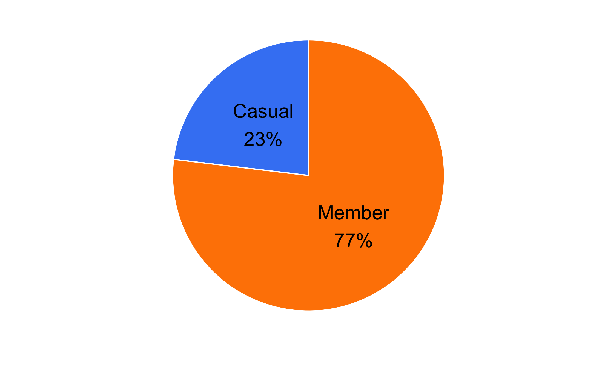
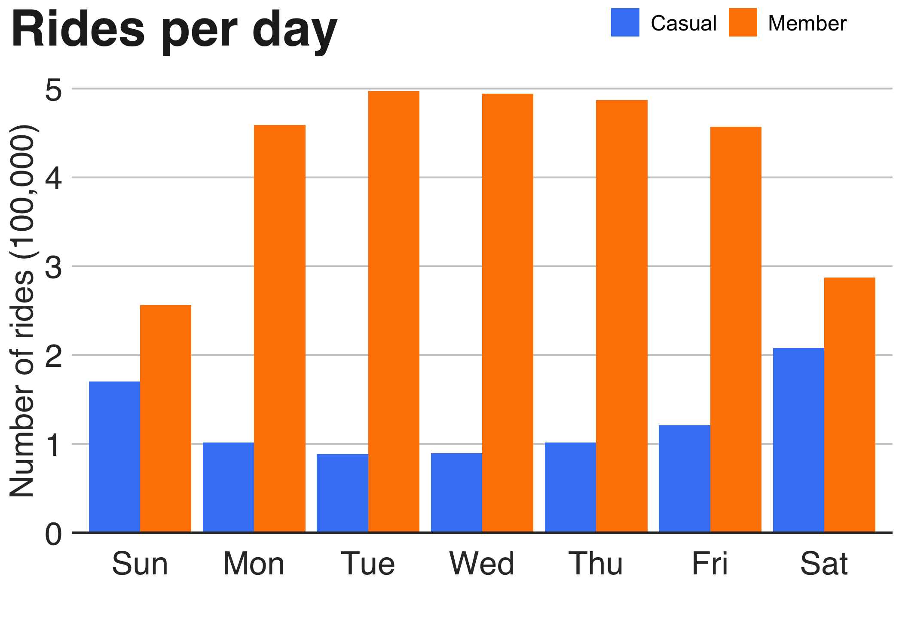
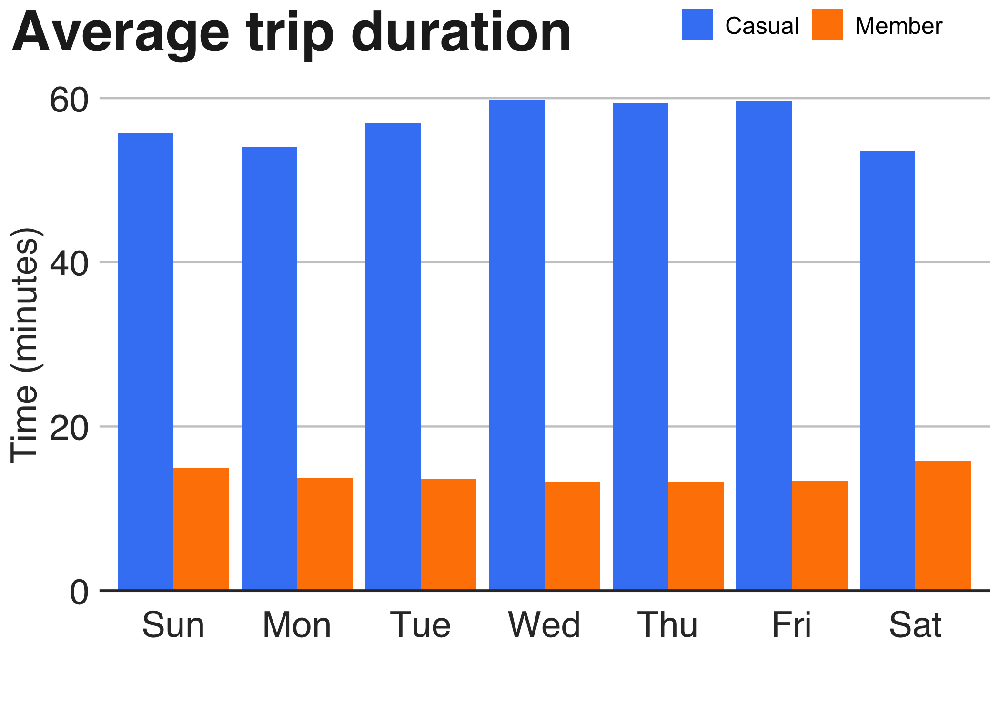
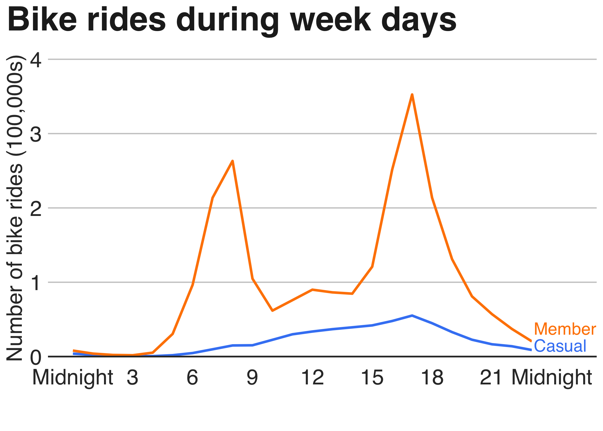
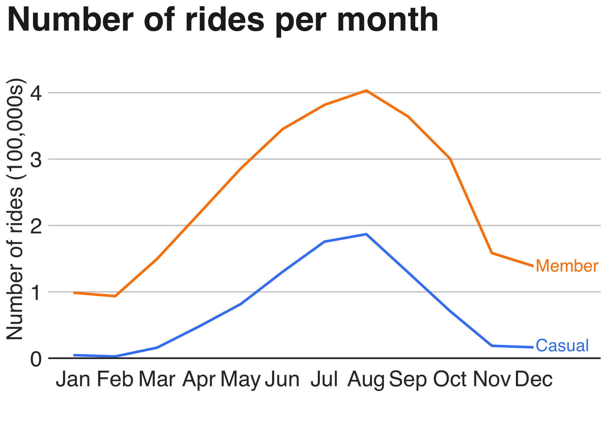
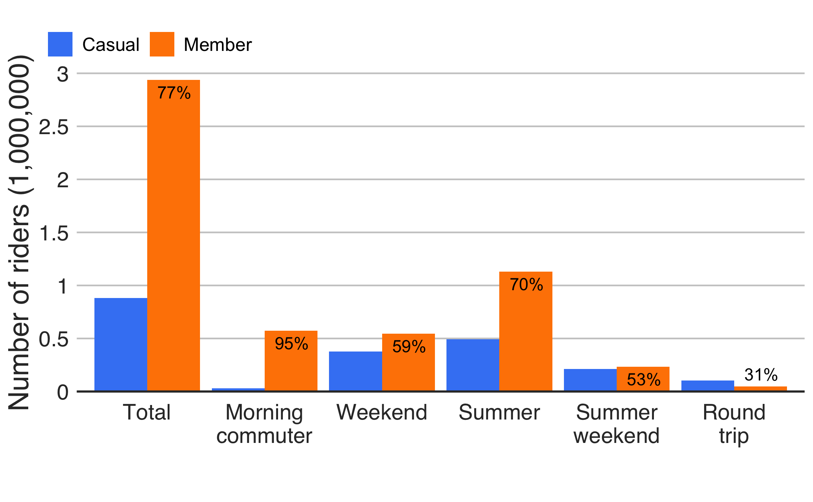
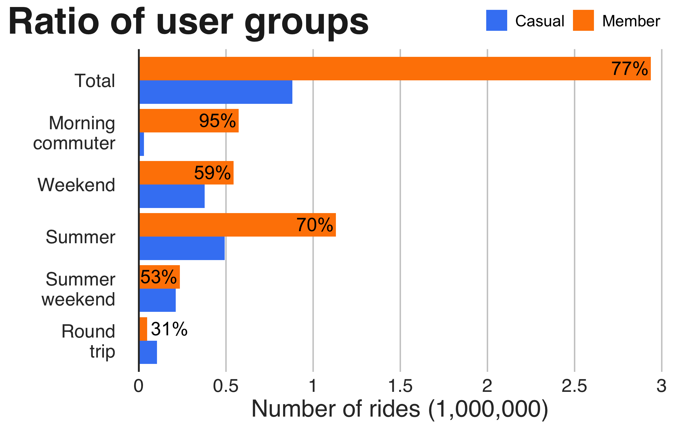
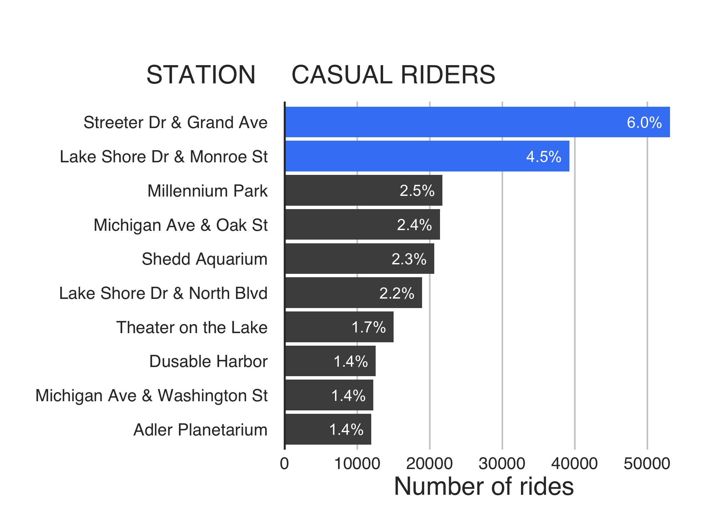

# Cyclistic Case Study
### Jonathan M Lines

# Intro
## Stakeholders. About the company
Cyclistic is a successful bike-sharing business with a fleet of 5824 bicycles spread over a network of 692 stations across Chicago. The bikes can be unlocked from one station and returned to any other station in the system. Cyclistic has flexible price plans: single-ride passes, full-day passes, and annual memberships. Customers who purchase single-ride or full-day passes are referred to as ‘casual’ riders. Customers who purchase annual memberships are Cyclistic ‘members’.
## Business Task
Cyclistic’s annual members are much more profitable than casual riders. Moreno believes that maximizing the number of annual members will be key to future growth. Rather than creating a marketing campaign that targets all-new customers, Moreno believes there is a very good chance to convert casual riders into members. She notes that casual riders are already aware of the Cyclistic program and have chosen Cyclistic for their mobility needs.
## Project task:
### How do annual members and casual riders use Cyclistic bikes differently?

# Data
## Prepare
The data set contains bike trip info for all four quarters of the year 2019. A supplementary data set about bike stations might also be used. This is first party data with personally identifiable information removed.
## Process
### Install required packages

```r
library(tidyverse)  #Data wrangling
library(lubridate)  #Data wrangling
library(janitor)    #Cleaning
library(naniar)     #Cleaning (NA's)
library(ggplot2)    #Data visualization
```

### Defaults and style guide for graphs

```R
colour1 <- "#FAAB18"   # yellow
colourCasual <- "#4285F4"   # blue
colourMember <- "#FF8400"   # orange"
colourGrey <- "grey30"      # grey
colourTitle <- "#222222"    # blash-ish
# colourSubtitle <- ""
colourAxis <- "#333333"     # black-ish
font <- "Helvetica"

upright_style <- function() {
  ggplot2::theme(
    #Text format: title and subtitle
    plot.title = ggplot2::element_text(family = font,
                            size = 28,
                            face = "bold",
                            color = colourTitle),
    plot.title.position = "plot", 
    plot.subtitle = ggplot2::element_text(family = font,
                               size = 22,
                               margin = ggplot2::margin(9,0,9,0)),
    # Legend
    legend.position = "top",
    legend.text.align = 0,
    legend.title = ggplot2::element_blank(),
    legend.background = ggplot2::element_blank(),
    legend.key = ggplot2::element_blank(), 
    legend.text = element_text(size = 12),
    #Grid lines
    panel.grid.minor = ggplot2::element_blank(),
    panel.grid.major.y = ggplot2::element_line(color="#cbcbcb"),
    panel.grid.major.x = ggplot2::element_blank(),
    panel.background = ggplot2::element_blank(),
    axis.title = ggplot2::element_text(family = font,
                                      size = 18,
                                      color = colourAxis),
    axis.text = ggplot2::element_text(family = font,
                                      size = 18,
                                      color = colourAxis),
    axis.text.x = ggplot2::element_text(margin = ggplot2::margin(t = -5, b = 10)),
    axis.line = ggplot2::element_blank(),
    axis.ticks.x = element_blank(),
    axis.ticks.y = element_blank(),
    #Strip (facet-wrapped plots)
    strip.background = ggplot2::element_rect(fill="white"),
    strip.text = ggplot2::element_text(size  = 22,  hjust = 0),
  )
}

side_style <- function() {
  ggplot2::theme(
    #Text format: title and subtitle
    plot.title = ggplot2::element_text(family = font,
                            size = 28,
                            face = "bold",
                            color = colourTitle),
    #plot.title.position = "plot", 
    plot.subtitle = ggplot2::element_text(family = font,
                               size = 22,
                               margin = ggplot2::margin(9,0,9,0)),
   # plot.subtitle.position = "plot", 
    # Legend
    legend.position = "top",
    legend.text.align = 0,
    legend.title = ggplot2::element_blank(),
    legend.background = ggplot2::element_blank(),
    legend.key = ggplot2::element_blank(), 
    legend.text = element_text(size = 12),
    #Grid lines
    panel.grid.minor = ggplot2::element_blank(),
    panel.grid.major.x = ggplot2::element_line(color="#cbcbcb"),
    panel.grid.major.y = ggplot2::element_blank(),
    panel.background = ggplot2::element_blank(),
    # axis
    axis.title = ggplot2::element_text(family = font,
                                      size = 18,
                                      color = colourAxis),
    axis.text = ggplot2::element_text(family = font,
                                      size = 18,
                                      color = colourAxis),
    axis.text.y = ggplot2::element_text(margin = ggplot2::margin(r = -5)),# l r t b 
    axis.line = ggplot2::element_blank(),
    axis.ticks.x = element_blank(), 
    axis.ticks.y = element_blank(),
    #Strip (facet-wrapped plots)
    strip.background = ggplot2::element_rect(fill="white"),
    strip.text = ggplot2::element_text(size  = 22,  hjust = 0)
  )
}

baseLine_style <- function() {
  geom_hline(yintercept = 0, size = 0.66, colour = colourAxis)
}

finalise_plot <- function(plot) {
  setwd("/Users/jonathanlines/Desktop/Case_Studies/Cyclistic")
  #ggsave(plot, width = width, height = height, units = "px")
  ggsave(plot)
  ## Return (invisibly) a copy of the graph. Can be assigned to a
  ## variable or silently ignored.
  #invisible(plot_grid)
}
```

### Load data

```R
#https://divvy-tripdata.s3.amazonaws.com/index.html
q1_2019 <- read_csv("2019/Divvy_Trips_2019_Q1.csv")
q2_2019 <- read_csv("2019/Divvy_Trips_2019_Q2.csv")
q3_2019 <- read_csv("2019/Divvy_Trips_2019_Q3.csv")
q4_2019 <- read_csv("2019/Divvy_Trips_2019_Q4.csv")
stations <- read_csv("2019/Divvy_Stations_2014-Q3Q4.csv")
```

### Check column names and data types

```R
data.frame(colnames(q1_2019),colnames(q2_2019),colnames(q3_2019),colnames(q4_2019))


##    colnames.q1_2019.                                colnames.q2_2019.
## 1            trip_id                    01 - Rental Details Rental ID
## 2         start_time             01 - Rental Details Local Start Time
## 3           end_time               01 - Rental Details Local End Time
## 4             bikeid                      01 - Rental Details Bike ID
## 5       tripduration 01 - Rental Details Duration In Seconds Uncapped
## 6    from_station_id                     03 - Rental Start Station ID
## 7  from_station_name                   03 - Rental Start Station Name
## 8      to_station_id                       02 - Rental End Station ID
## 9    to_station_name                     02 - Rental End Station Name
## 10          usertype                                        User Type
## 11            gender                                    Member Gender
## 12         birthyear         05 - Member Details Member Birthday Year
##    colnames.q3_2019. colnames.q4_2019.
## 1            trip_id           trip_id
## 2         start_time        start_time
## 3           end_time          end_time
## 4             bikeid            bikeid
## 5       tripduration      tripduration
## 6    from_station_id   from_station_id
## 7  from_station_name from_station_name
## 8      to_station_id     to_station_id
## 9    to_station_name   to_station_name
## 10          usertype          usertype
## 11            gender            gender
## 12         birthyear         birthyear
```

### Compare column data types

```R
compare_df_cols(q1_2019, q2_2019, q3_2019, q4_2019, return = "mismatch")
## [1] column_name q1_2019     q2_2019     q3_2019     q4_2019    
## <0 rows> (or 0-length row.names)
```

### Rename columns
```R
(q1_2019 <- rename(q1_2019
                   ,bike_id = bikeid
                   ,trip_duration = tripduration
                   ,birth_year = birthyear
                   ,start_station_name = from_station_name 
                   ,start_station_id = from_station_id 
                   ,end_station_name = to_station_name 
                   ,end_station_id = to_station_id))

(q2_2019 <- rename(q2_2019
                   ,trip_id = "01 - Rental Details Rental ID"
                   ,bike_id = "01 - Rental Details Bike ID" 
                   ,start_time = "01 - Rental Details Local Start Time"  
                   ,trip_duration = "01 - Rental Details Duration In Seconds Uncapped"  
                   ,end_time = "01 - Rental Details Local End Time"  
                   ,start_station_name = "03 - Rental Start Station Name" 
                   ,start_station_id = "03 - Rental Start Station ID"
                   ,end_station_name = "02 - Rental End Station Name" 
                   ,end_station_id = "02 - Rental End Station ID"
                   ,gender = "Member Gender" 
                   ,birth_year = "05 - Member Details Member Birthday Year"
                   ,usertype = "User Type"))

(q3_2019 <- rename(q3_2019
                   ,bike_id = bikeid
                   ,trip_duration = tripduration
                   ,birth_year = birthyear
                   ,start_station_name = from_station_name 
                   ,start_station_id = from_station_id 
                   ,end_station_name = to_station_name 
                   ,end_station_id = to_station_id))

(q4_2019 <- rename(q4_2019
                   ,bike_id = bikeid
                   ,trip_duration = tripduration
                   ,birth_year = birthyear
                   ,start_station_name = from_station_name 
                   ,start_station_id = from_station_id 
                   ,end_station_name = to_station_name 
                   ,end_station_id = to_station_id))
```

### Compare columns names

```R
data.frame(colnames(q1_2019),colnames(q2_2019),colnames(q3_2019),colnames(q4_2019))


##     colnames.q1_2019.  colnames.q2_2019.  colnames.q3_2019.  colnames.q4_2019.
## 1             trip_id            trip_id            trip_id            trip_id
## 2          start_time         start_time         start_time         start_time
## 3            end_time           end_time           end_time           end_time
## 4             bike_id            bike_id            bike_id            bike_id
## 5       trip_duration      trip_duration      trip_duration      trip_duration
## 6    start_station_id   start_station_id   start_station_id   start_station_id
## 7  start_station_name start_station_name start_station_name start_station_name
## 8      end_station_id     end_station_id     end_station_id     end_station_id
## 9    end_station_name   end_station_name   end_station_name   end_station_name
## 10           usertype           usertype           usertype           usertype
## 11             gender             gender             gender             gender
## 12         birth_year         birth_year         birth_year         birth_year
```

### Are column names all the same ?

```R
compare_df_cols_same(q1_2019, q2_2019, q3_2019, q4_2019)
## [1] TRUE
```

### Compare column data types

```R
compare_df_cols(q1_2019, q2_2019, q3_2019, q4_2019, return = "mismatch")
## [1] column_name q1_2019     q2_2019     q3_2019     q4_2019    
## <0 rows> (or 0-length row.names)
```

### Combine data frames

```R
total_trips <- rbind(q1_2019, q2_2019, q3_2019, q4_2019)
```

### Change data types

```R
total_trips <- mutate(total_trips, trip_id = as.integer(trip_id),
                      bike_id = as.integer(bike_id),
                      start_station_id = as.integer(start_station_id),
                      end_station_id = as.integer(end_station_id),
                      usertype = as.factor(usertype),
                      gender = as.factor(gender))
# summary(total_trips)
```

### Check station name spelling. What station is in end_station_name but not start_station_name coloumns ?

```R
start_stations <- select(total_trips, start_station_name) |>
  mutate(start_station_name = tolower(start_station_name)) |>
  group_by(start_station_name) |>
  summarise(no_rows = length(start_station_name)) |>
  arrange(no_rows) |>
  select(station_name = start_station_name)
# A tibble: 640 × 1

end_stations <- select(total_trips, end_station_name) |>
  mutate(end_station_name = tolower(end_station_name)) |>
  group_by(end_station_name) |>
  summarise(no_rows = length(end_station_name)) |>
  arrange(no_rows) |>
  select(station_name = end_station_name)
# A tibble: 641 × 1

start_id <- select(total_trips, start_station_name, start_station_id) |>
  group_by(start_station_name) |>
  summarise(no_rows = length(start_station_name))
# A tibble: 640 × 2

end_id <- select(total_trips, end_station_name, end_station_id) |>
  group_by(end_station_name) |>
  summarise(no_rows = length(end_station_name))
# A tibble: 641 × 2

anti_join(start_stations, end_stations, by = "station_name")

anti_join(end_stations, start_stations, by = "station_name")

## # A tibble: 1 × 1
##   station_name            
##   <chr>                   
## 1 ts ~ divvy parts testing
```

### Check age range. Someone was born on 1759

```R
ages <- select(total_trips, birth_year) |>
  mutate(age = 2019 - birth_year) 

ggplot(ages, aes(x = age)) +
  geom_histogram(binwidth = 10, na.rm = TRUE, colour = "white", fill = colourGrey) +
  upright_style() +
  baseLine_style() +
  labs(title = "Age of riders",
       subtitle = "5 to 260 years old")
```

>
> graph here
>

```R
arrange(ages, age)
## # A tibble: 3,818,004 × 2
##    birth_year   age
##         <dbl> <dbl>
##  1       2014     5
##  2       2014     5
##  3       2014     5
##  4       2014     5
##  5       2014     5
##  6       2003    16
##  7       2003    16
##  8       2003    16
##  9       2003    16
## 10       2003    16
## # … with 3,817,994 more rows

arrange(ages, -age)
## # A tibble: 3,818,004 × 2
##    birth_year   age
##         <dbl> <dbl>
##  1       1759   260
##  2       1790   229
##  3       1888   131
##  4       1888   131
##  5       1888   131
##  6       1888   131
##  7       1888   131
##  8       1888   131
##  9       1888   131
## 10       1888   131
## # … with 3,817,994 more rows

highAgeRange <- filter(ages, age > 65 & age < 85)

ggplot(highAgeRange, aes(x = age)) +
  geom_histogram(binwidth = 1, colour = "white", fill = colourGrey) +
  upright_style() +
  baseLine_style() +
  scale_x_continuous(limits = c(65, 85),
                     breaks = seq(65, 85, by = 5),
                     labels = c("65", "70", "75", "80", "90")) +
  labs(title = "Age of riders",
       subtitle = "65 to years old")
```

>
> graph here
>

```R
dim(filter(ages, age > 75))
## [1] 1954    2

dim(filter(ages, age < 16))
## [1] 5 2
```

### 1954 riders have ages between 76 and 260. 5 riders are 5 years old. This is incorrect data. Replace false birth_year data with NA’s and gender NA’s with Unknown.

```R
trips.cleaned <- total_trips |>
  mutate_at(vars(birth_year),
            function(.var){
              if_else(.var < 1944 | .var > 2003,
                      true = as.numeric(NA),
                      false = .var)
            }) |>
  mutate(gender = fct_explicit_na(gender, na_level = "Unknown"))
# summary(trips.cleaned)
```

## Process

### Tidy up columns. Covert trip_duration from seconds to minutes. Age is more useful than birth_year. Split start_time into month weekday and hour. Knowing if trip is over more than one day might be useful. Change usertype factors to Member and Casual.

```R
trips.cleaned <- trips.cleaned |>
  mutate(trip_duration = as.integer(trip_duration / 60)) |> # sec to min
  mutate(age = 2019 - birth_year) |>
  mutate(month = month(start_time)) |>
  mutate(weekday = wday(start_time, TRUE, TRUE)) |> # (dateTime, label, abbr)
  mutate(hour = hour(start_time)) |>
  mutate(returned_same_day = ifelse(wday(start_time) == wday(end_time), TRUE, FALSE)) |>
  mutate(usertype = as.factor(ifelse(usertype == "Subscriber", "Member", "Casual")))
        
# summary(trips.cleaned)
```

## Discriptive analysis

### Compare members and casual users

```R
aggregate(trips.cleaned$trip_duration ~ trips.cleaned$usertype, FUN = mean)
##   trips.cleaned$usertype trips.cleaned$trip_duration
## 1                 Casual                    56.52344
## 2                 Member                    13.83169

aggregate(trips.cleaned$trip_duration ~ trips.cleaned$usertype, FUN = median)
##   trips.cleaned$usertype trips.cleaned$trip_duration
## 1                 Casual                          25
## 2                 Member                           9

# plotting graph
pie <- trips.cleaned |>
  group_by(usertype) |>
  summarise(number_trips = n()) |>
  mutate(percentage = round(number_trips / sum(number_trips), 3))
pie
## # A tibble: 2 × 3
##   usertype number_trips percentage
##   <fct>           <int>      <dbl>
## 1 Casual         880637      0.231
## 2 Member        2937367      0.769
```

```R
pie |>
  ggplot(aes(x="", y=percentage, fill=usertype)) +
  geom_bar(stat="identity", width=1, color="white") +
  coord_polar("y", start = 0) +
  theme_minimal() +
  #upright_style() +
  labs(x ="", y = "") +#, title = "Distribution of trips") +
  geom_text(aes(label = scales::percent(percentage, accuracy = 1.0, trim = FALSE)),
            position = position_stack(vjust = 0.5)) +
  geom_label(aes(label = glue::glue("{usertype}\n{scales::percent(percentage)}")),
                  position = position_stack(vjust = 0.5),
             label.size = NA,
             size = 6) +
  scale_fill_manual(values = c(colourCasual, colourMember)) +
  theme(plot.title = element_text(family ="Helvetica",
                                  size = 28,
                                  face = "bold",
                                  colour = "#222222"),
        plot.title.position = "plot", 
        axis.text = element_blank(),
        axis.ticks = element_blank(),
        panel.grid  = element_blank(),
        legend.position = "none")
```



### analyze ridership data by type and weekday

```R
trips_by_day <- trips.cleaned |> 
  group_by(weekday, usertype) |>  # groups by usertype and weekday
  summarise(number_of_rides = n()   # number of rides 
            ,average_duration = mean(trip_duration)) |>
  arrange(weekday, usertype)
```

### Visualize the number of rides per day

```R
trips_by_day |>
  ggplot(aes(x = weekday, y = number_of_rides, fill = usertype)) +
  upright_style() +
  geom_bar(stat = "identity", position = "dodge") +
  baseLine_style() +
  scale_fill_manual(values = c(colourCasual, colourMember)) +
  labs(title = "  ",#Riders per day",
      x = "", y = "Number of riders (100,000)") +
  theme(legend.position = c(0.1, 1.05)) +
  guides(fill = guide_legend(ncol = 2)) +
  scale_y_continuous(limits = c(0, 500000),
                     breaks = seq(0, 500000, by = 100000),
                     labels = c("0", "1", "2", "3", "4", "5"))
```



### Visualization for average duration per day

```R
trips_by_day |>
  ggplot(aes(x = weekday, y = average_duration, fill = usertype)) +
  upright_style() +
  geom_col(position = "dodge") +
  baseLine_style() +
  scale_fill_manual(values = c(colourCasual, colourMember)) +
  labs(title = "  ",#Average trip duration",
       x = "", y = "Time (minutes)") +
  theme(legend.position = c(0.1, 1.05)) +
  guides(fill = guide_legend(ncol = 2)) +
  scale_y_continuous(limits = c(0, 60),
                     breaks = seq(0, 60, by = 20),
                     labels = c("0", "20", "40", "60"))
```



### Plot summary statistics of trip duration per day

```R
trips.cleaned |>
  ggplot(aes(x = weekday, y = trip_duration, fill = usertype)) +
  geom_boxplot(outlier.colour = "light grey", outlier.size = 0.25) +
  upright_style() +
  coord_cartesian(ylim = c(0, 50)) +
  baseLine_style() +
  labs(title="Trip duration statistics",
       x = "", y = "Time (minutes)") +
  theme(legend.position = c(0.8, 1.1)) +
  guides(fill = guide_legend(ncol = 2)) +
  scale_fill_manual(values = c(colourCasual, colourMember))
```

## Explorative analysis

### Analyze ridership data by type and weekday

```R
trips_by_hour <- trips.cleaned |> 
  group_by(hour, usertype) |>  # groups by hour of day and usertype
  summarise(number_of_rides = n()   # number of rides 
            ,average_duration = mean(trip_duration)) |>
  arrange(hour, usertype)

ggplot(trips_by_hour, aes(x = hour, y = number_of_rides, colour = usertype)) +
  geom_line(size = 1) +
  upright_style() +
  theme(legend.position = "none") +
  scale_colour_manual(values = c(colourCasual, colourMember)) +
  scale_x_continuous(limits = c(0, 25), 
                     breaks = c(0, 3, 6, 9, 12, 15, 18, 21, 24),
                     labels = c("Midnight", "3", "6", "9", "12", "15", "18", "21", "Midnight")) +
  scale_y_continuous(limits = c(0, 400000), breaks = seq(0, 400000, by = 100000),
                     labels = c("0", "1", "2", "3", "4")) +
  baseLine_style() +
  labs(title="Daily bike rides",
       subtitle = "During full week",
       x = "", y = "Number of bike rides (100,000s)") +
  geom_label(aes(x = 23.25, y = 15000, label = "Casual"), 
             hjust = 0, 
             vjust = 0.5, 
             colour = colourCasual, 
             fill = "white", 
             label.size = NA, 
             family="Helvetica", 
             label.padding = unit(0.1, "lines"), 
             size = 3.25) +
  geom_label(aes(x = 23.25, y = 35000, label = "Member"), 
             hjust = 0, 
             vjust = 0.5, 
             colour = colourMember, 
             fill = "white", 
             label.size = NA, 
             family="Helvetica", 
             label.padding = unit(0.1, "lines"), 
             size = 3.25)
```



```R
trips_by_hour_on_weekend <- trips.cleaned |> 
  filter(weekday == "Sun" | weekday == "Sat") |>
  group_by(hour, usertype) |>  # groups by usertype and weekday
  summarise(number_of_rides = n()   # number of rides 
            ,average_duration = mean(trip_duration)) |>
  arrange(hour, usertype)

ggplot(trips_by_hour_on_weekend, aes(x = hour, y = number_of_rides, colour = usertype)) +
  geom_line(size = 1) +
  upright_style() +
  theme(legend.position = "none") +
  baseLine_style() +
  scale_x_continuous(limits = c(0, 25), breaks = c(0, 3, 6, 9, 12, 15, 18, 21, 24, 27),
                     labels = c("Midnight", "3", "6", "9", "12", "15", "18", "21", "Midnight", " ")) +
  scale_y_continuous(limits = c(0, 50000), breaks = seq(0, 50000, by = 10000),
                     labels = c("0", "10", "20", "30", "40", "50")) +
  scale_colour_manual(values = c(colourCasual, colourMember)) +
  labs(#title="Daily bike rides",
       #subtitle = "During the weekend",
        x = "", y = "Number of bike rides (1000s)") +
  geom_label(aes(x = 23.25, y = 5500, label = "Casual"), 
             hjust = 0, 
             vjust = 0.5, 
             colour = colourCasual, 
             fill = "white", 
             label.size = NA, 
             family="Helvetica", 
             label.padding = unit(0.1, "lines"), 
             size = 3.25) +
  geom_label(aes(x = 23.25, y = 8000, label = "Member"), 
             hjust = 0, 
             vjust = 0.5, 
             colour = colourMember, 
             fill = "white", 
             label.size = NA, 
             family="Helvetica", 
             label.padding = unit(0.1, "lines"), 
             size = 3.25)
```


```R
trips_by_hour_on_week <- trips.cleaned |> 
  filter(weekday != "Sun" & weekday != "Sat") |>
  #filter(weekday == "Mon" | weekday == "Tue" | weekday == "Wed" | weekday == "Thu" | weekday == "Fri") |>
  group_by(hour, usertype) |>
  summarise(number_of_rides = n()   
            ,average_duration = mean(trip_duration)) |>
  arrange(hour, usertype)

ggplot(trips_by_hour_on_week, aes(x = hour, y = number_of_rides, colour = usertype)) +
  geom_line(size = 1) +
  upright_style() +
  theme(legend.position = "none") +
  baseLine_style() +
  scale_x_continuous(limits = c(0, 25), breaks = c(0, 3, 6, 9, 12, 15, 18, 21, 24),
                     labels = c("Midnight", "3", "6", "9", "12", "15", "18", "21", "Midnight")) +
  scale_y_continuous(limits = c(0, 400000), breaks = seq(0, 400000, by = 100000),
                     labels = c("0", "1", "2", "3", "4")) +
  scale_colour_manual(values = c(colourCasual, colourMember)) +
  labs(#title="Daily bike rides",
       #subtitle = "During week days",
       x = "", y = "Number of bike rides (100,000s)") +
    geom_label(aes(x = 23.25, y = 15000, label = "Casual"), 
             hjust = 0, 
             vjust = 0.5, 
             colour = colourCasual, 
             fill = "white", 
             label.size = NA, 
             family="Helvetica", 
             label.padding = unit(0.1, "lines"), 
             size = 3.25) +
  geom_label(aes(x = 23.25, y = 35000, label = "Member"), 
             hjust = 0, 
             vjust = 0.5, 
             colour = colourMember, 
             fill = "white", 
             label.size = NA, 
             family="Helvetica", 
             label.padding = unit(0.1, "lines"), 
             size = 3.25)

#finalise_plot(plot = "Weekday_rides.png")
```


### Analyze ridership data by type and weekday

```R
trips_by_month <- trips.cleaned |> 
  group_by(month, usertype) |>  # groups by usertype and weekday
  summarise(number_of_rides = n()   # number of rides 
            ,average_duration = mean(trip_duration)) |>
  arrange(month, usertype)

ggplot(trips_by_month, aes(x = month, y = number_of_rides, colour = usertype)) +
  geom_line(size = 1) +
  upright_style() +
  theme(legend.position = "none") +
  scale_x_continuous(limits = c(1, 13), breaks = c(1, 2, 3, 4, 5, 6, 7, 8, 9, 10, 11, 12, 13),
                     labels = c("Jan", "Feb", "Mar", "Apr", "May", "Jun", "Jul", "Aug","Sep", "Oct", "Nov", "Dec", "")) +
  scale_y_continuous(limits = c(0, 450000), breaks = seq(0, 450000, by = 100000),
                     labels = c("0", "1", "2", "3", "4")) +
  baseLine_style() +
  scale_colour_manual(values = c(colourCasual, colourMember)) +
  labs(#title="Number of riders per month",
       y = "Number of rides (100,000s)", x = "") +
    geom_label(aes(x = 12.25, y = 20000, label = "Casual"), 
             hjust = 0, 
             vjust = 0.5, 
             colour = colourCasual, 
             fill = "white", 
             label.size = NA, 
             family="Helvetica", 
             label.padding = unit(0.1, "lines"), 
             size = 3.25) +
  geom_label(aes(x = 12.25, y = 140000, label = "Member"), 
             hjust = 0, 
             vjust = 0.5, 
             colour = colourMember, 
             fill = "white", 
             label.size = NA, 
             family="Helvetica", 
             label.padding = unit(0.1, "lines"), 
             size = 3.25)
```



### analyze ridership data by type and weekday

```R
trips_by_month_weekend <- trips.cleaned |> 
  filter(weekday == "Sun" | weekday == "Sat") |>
  group_by(month, usertype) |>  # groups by usertype and weekday
  summarise(number_of_rides = n()   # number of rides 
            ,average_duration = mean(trip_duration)) |>
  arrange(month, usertype)

ggplot(trips_by_month_weekend, aes(x = month, y = number_of_rides, colour = usertype)) +
  geom_line(size = 1) +
  upright_style() +
  theme(legend.position = "none") +
  scale_x_continuous(limits = c(1, 13), breaks = c(1, 2, 3, 4, 5, 6, 7, 8, 9, 10, 11, 12, 13),
                     labels = c("Jan", "Feb", "Mar", "Apr", "May", "Jun", "Jul", "Aug","Sep", "Oct", "Nov", "Dec", "")) +
  scale_y_continuous(limits = c(0, 450000), breaks = seq(0, 450000, by = 100000),
                     labels = c("0", "1", "2", "3", "4")) +
  baseLine_style() +
  scale_colour_manual(values = c(colourCasual, colourMember)) +
  labs(title="Number of riders per month",
       subtitle = "During weekends",
       y = "Number of rides (100,000s)", x = "") +
  geom_label(aes(x = 12.25, y = 14000, label = "Casual"), 
             hjust = 0, 
             vjust = 0.5, 
             colour = colourCasual, 
             fill = "white", 
             label.size = NA, 
             family="Helvetica", 
             label.padding = unit(0.1, "lines"), 
             size = 3.25) +
  geom_label(aes(x = 12.25, y = 32000, label = "Member"), 
             hjust = 0, 
             vjust = 0.5, 
             colour = colourMember, 
             fill = "white", 
             label.size = NA, 
             family="Helvetica", 
             label.padding = unit(0.1, "lines"), 
             size = 3.25)
```

```R
trips_by_month_week <- trips.cleaned |> 
  filter(weekday == "Mon" | weekday == "Tue" | weekday == "Wed" | weekday == "Thu"| weekday == "Fri") |>
  group_by(month, usertype) |>  # groups by usertype and weekday
  summarise(number_of_rides = n()   # number of rides 
            ,average_duration = mean(trip_duration)) |>
  arrange(month, usertype)

ggplot(trips_by_month_week, aes(x = month, y = number_of_rides, colour = usertype)) +
  geom_line(size = 1) +
  upright_style() +
  theme(legend.position = "none") +
  scale_x_continuous(limits = c(1, 13), breaks = c(1, 2, 3, 4, 5, 6, 7, 8, 9, 10, 11, 12, 13),
                     labels = c("Jan", "Feb", "Mar", "Apr", "May", "Jun", "Jul", "Aug","Sep", "Oct", "Nov", "Dec", "")) +
  scale_y_continuous(limits = c(0, 450000), breaks = seq(0, 450000, by = 100000),
                     labels = c("0", "1", "2", "3", "4")) +
  baseLine_style() +
  scale_colour_manual(values = c(colourCasual, colourMember)) +
  labs(title="Number of riders per month",
       subtitle = "During week days",
       y = "Number of rides (100,000s)", x = "") +
  geom_label(aes(x = 12.25, y = 14000, label = "Casual"), 
             hjust = 0, 
             vjust = 0.5, 
             colour = colourCasual, 
             fill = "white", 
             label.size = NA, 
             family="Helvetica", 
             label.padding = unit(0.1, "lines"), 
             size = 3.25) +
  geom_label(aes(x = 12.25, y = 115000, label = "Member"), 
             hjust = 0, 
             vjust = 0.5, 
             colour = colourMember, 
             fill = "white", 
             label.size = NA, 
             family="Helvetica", 
             label.padding = unit(0.1, "lines"), 
             size = 3.25)
```

```R
morning_commuter <- trips.cleaned |>
  filter(weekday != "Sun" & weekday != "Sat") |>
  filter(hour == 6 | hour == 7 | hour == 8) |>
  filter(trip_duration < 61) |>
  group_by(trip_duration, usertype) |>
  summarise(number_of_rides = n()) |>
  arrange(trip_duration, usertype) |>
  mutate(temp_usertype = ifelse(usertype =="Member", "Morning_mem", "Morning_cas"))

morning_commuter
## # A tibble: 120 × 4
## # Groups:   trip_duration [60]
##    trip_duration usertype number_of_rides temp_usertype
##            <int> <fct>              <int> <chr>        
##  1             1 Casual                66 Morning_cas  
##  2             1 Member              4917 Morning_mem  
##  3             2 Casual               231 Morning_cas  
##  4             2 Member             19775 Morning_mem  
##  5             3 Casual               586 Morning_cas  
##  6             3 Member             34242 Morning_mem  
##  7             4 Casual               895 Morning_cas  
##  8             4 Member             42834 Morning_mem  
##  9             5 Casual              1222 Morning_cas  
## 10             5 Member             44971 Morning_mem  
## # … with 110 more rows
```

```R
evening_commuter <- trips.cleaned |>
  filter(weekday != "Sun" & weekday != "Sat") |>
  filter(hour == 16 | hour == 17 | hour == 18) |>
  filter(trip_duration < 61) |>
  group_by(trip_duration, usertype) |>
  summarise(number_of_rides = n()) |>
  arrange(trip_duration, usertype) |>
  mutate(temp_usertype = ifelse(usertype =="Member", "Evening_mem", "Evening_cas"))

evening_commuter
## # A tibble: 120 × 4
## # Groups:   trip_duration [60]
##    trip_duration usertype number_of_rides temp_usertype
##            <int> <fct>              <int> <chr>        
##  1             1 Casual               334 Evening_cas  
##  2             1 Member              5935 Evening_mem  
##  3             2 Casual               385 Evening_cas  
##  4             2 Member             22593 Evening_mem  
##  5             3 Casual               823 Evening_cas  
##  6             3 Member             40579 Evening_mem  
##  7             4 Casual              1526 Evening_cas  
##  8             4 Member             52808 Evening_mem  
##  9             5 Casual              2197 Evening_cas  
## 10             5 Member             56721 Evening_mem  
## # … with 110 more rows
```

```R
commuters <- rbind(morning_commuter, evening_commuter)
commuters <- mutate(commuters, temp_usertype = as.factor(temp_usertype))

commuters
## # A tibble: 240 × 4
## # Groups:   trip_duration [60]
##    trip_duration usertype number_of_rides temp_usertype
##            <int> <fct>              <int> <fct>        
##  1             1 Casual                66 Morning_cas  
##  2             1 Member              4917 Morning_mem  
##  3             2 Casual               231 Morning_cas  
##  4             2 Member             19775 Morning_mem  
##  5             3 Casual               586 Morning_cas  
##  6             3 Member             34242 Morning_mem  
##  7             4 Casual               895 Morning_cas  
##  8             4 Member             42834 Morning_mem  
##  9             5 Casual              1222 Morning_cas  
## 10             5 Member             44971 Morning_mem  
## # … with 230 more rows
```

```R
ggplot(commuters, aes(x = trip_duration, y = number_of_rides,
                      colour = temp_usertype, linetype = temp_usertype)) +
  geom_line(size = 1) +
  upright_style() +
  baseLine_style() +
  theme(legend.text = element_text(size = 12)) +
  scale_linetype_manual(values = c("dotdash", "dotdash", "solid", "solid")) +
  scale_colour_manual(values = c(colourCasual, colourMember, colourCasual, colourMember)) +
  labs(title="Number of riders taking x minutes")


```

```R
# ratio of morning commuter usertypes
morning_commuter_summary <- trips.cleaned |>
  filter(weekday != "Sun" & weekday != "Sat") |>
  filter(hour == 6 | hour == 7 | hour == 8) |>
  select(usertype)
summary(morning_commuter_summary)
##    usertype     
##  Casual: 29451  
##  Member:573302


# % morning commuter members
573302 / (29451 + 573302) * 100
## [1] 95.11392

x <- summary(morning_commuter_summary)
# ratio of morning summer commuter usertypes
morning_summer_commuter_summary <- trips.cleaned |>
  filter(month == 6 | month == 7 | month == 8) |>
  filter(weekday != "Sun" & weekday != "Sat") |>
  filter(hour == 6 | hour == 7 | hour == 8) |>
  select(usertype)
summary(morning_summer_commuter_summary)
##    usertype     
##  Casual: 14565  
##  Member:205273

# % morning summer commuter members
205273 / (14565 + 205273) * 100
## [1] 93.37467

# ratio of total usertypes
total_users <- trips.cleaned |>
  select(usertype)
summary(total_users)
##    usertype      
##  Casual: 880637  
##  Member:2937367

# % total members
2937367 / (880637 + 2937367) * 100
## [1] 76.93462

# ratio of summer usertypes
summer_users <- trips.cleaned |>
  filter(month == 6 | month == 7 | month == 8) |>
  select(usertype)
summary(summer_users)
##    usertype      
##  Casual: 492739  
##  Member:1130155

# % summer members
1130155 / (492739 + 1130155) * 100
## [1] 69.63825

# ratio of weekend usertypes
weekend_users <- trips.cleaned |>
  filter(weekday == "Sat" | weekday == "Sun") |>
  select(usertype)
summary(weekend_users)
##    usertype     
##  Casual:378235  
##  Member:543404

# % weekend members
543404 / (378235 + 543404) * 100
## [1] 58.96061

# ratio of summer weekend usertypes
summer_weekend_users <- trips.cleaned |>
  filter(month == 6 | month == 7 | month == 8) |>
  filter(weekday == "Sat" | weekday == "Sun") |>
  select(usertype)
summary(summer_weekend_users)
##    usertype     
##  Casual:211418  
##  Member:234710

# % summer weekend members
234710 / (211418 + 234710) * 100
## [1] 52.61046

# ratio of summer weekend usertypes
summer_week_users <- trips.cleaned |>
  filter(month == 6 | month == 7 | month == 8) |>
  filter(weekday != "Sat" & weekday != "Sun") |>
  select(usertype)
summary(summer_week_users)
##    usertype     
##  Casual:281321  
##  Member:895445

# % summer week members
895445 / (281321 + 895445) * 100
## [1] 76.09372

# ratio of summer weekend usertypes
summer_week_users <- trips.cleaned |>  # 5 months
  filter(month == 5 |month == 6 | month == 7 | month == 8 | month == 9) |>
  filter(weekday != "Sat" | weekday != "Sun") |>
  select(usertype)
summary(summer_week_users)
##    usertype      
##  Casual: 703536  
##  Member:1780035

# % summer week members
1780035 / (703536 + 1780035) * 100
## [1] 71.6724

# ratio of summer weekend usertypes
summer_week_users <- trips.cleaned |>  # 6 months
  filter(month == 4 | month == 5 |month == 6 | month == 7 | month == 8 | month == 9) |>
  filter(weekday != "Sat" & weekday != "Sun") |>
  select(usertype)
summary(summer_week_users)
##    usertype      
##  Casual: 428831  
##  Member:1612760

# % summer week members
1612760 / (428831 + 1612760) * 100
## [1] 78.99525

# ratio of summer weekend usertypes
summer_week_users <- trips.cleaned |>  # 6 months
  filter(month == 5 |month == 6 | month == 7 | month == 8 | month == 9 | month == 10) |>
  filter(weekday != "Sat" & weekday != "Sun") |>
  select(usertype)
summary(summer_week_users)
##    usertype      
##  Casual: 442625  
##  Member:1680609

# % summer week members
1680609 / (442625 + 1680609) * 100
## [1] 79.15326
```

### Round trips (keepfit and leisure)

```R
# ratio of summer weekend roundtrip usertypes
round_trips <- trips.cleaned |>
  filter(start_station_id == end_station_id) |>
  select(usertype)
summary(round_trips)
##    usertype     
##  Casual:104598  
##  Member: 47649

104598 + 47649
## [1] 152247

# % summer weekend roundtrip members
47649 / (104598 + 47649) * 100
## [1] 31.29717

round_trips <- trips.cleaned |>
  filter(start_station_id == end_station_id) |>
  group_by(start_station_name) |>
  summarise(number_of_rides = n(),
            perc_of_rides = n() / 152247 * 100,
            average_age = mean(age, na.rm = TRUE),
            average_duration = mean(trip_duration)) |>
  arrange(-number_of_rides)
#summary(mean(round_trips))
round_trips
## # A tibble: 639 × 5
##    start_station_name number_of_rides perc_of_rides average_age average_duration
##    <chr>                        <int>         <dbl>       <dbl>            <dbl>
##  1 Streeter Dr & Gra…            9274          6.09        33.8             53.2
##  2 Lake Shore Dr & M…            8554          5.62        32.2             45.4
##  3 Michigan Ave & Oa…            5437          3.57        35.7             59.1
##  4 Millennium Park               3082          2.02        34.2             54.4
##  5 Montrose Harbor               3019          1.98        34.4             57.8
##  6 Theater on the La…            2567          1.69        31.6             47.9
##  7 Lake Shore Dr & N…            2353          1.55        32.8             52.9
##  8 Shedd Aquarium                1985          1.30        34.9             38.1
##  9 Michigan Ave & 8t…            1916          1.26        35.3             58.9
## 10 Adler Planetarium             1807          1.19        38.1             44.2
## # … with 629 more rows

round_trips_members <- trips.cleaned |>
  filter(start_station_id == end_station_id & usertype == "Member") |>
  group_by(start_station_name) |>
  summarise(number_of_rides = n(),
            perc_of_rides = n() / 47649 * 100,
            average_age = mean(age, na.rm = TRUE),
            average_duration = mean(trip_duration)) |>
  arrange(-number_of_rides)
#summary(mean(round_trips_members))

round_trips_members
## # A tibble: 623 × 5
##    start_station_name number_of_rides perc_of_rides average_age average_duration
##    <chr>                        <int>         <dbl>       <dbl>            <dbl>
##  1 Streeter Dr & Gra…             642         1.35         34.8             25.8
##  2 Theater on the La…             578         1.21         33.8             26.0
##  3 Lake Shore Dr & N…             526         1.10         34.9             35.9
##  4 Lake Shore Dr & M…             502         1.05         34.5             21.4
##  5 Burnham Harbor                 497         1.04         38.4             29.9
##  6 Michigan Ave & Oa…             447         0.938        36.0             32.6
##  7 Loomis St & Lexin…             405         0.850        28.5             14.9
##  8 Wabash Ave & Gran…             403         0.846        35.8             41.5
##  9 Montrose Harbor                394         0.827        39.2             24.6
## 10 Adler Planetarium              384         0.806        42.2             19.0
## # … with 613 more rows

round_trips_casuals <- trips.cleaned |>
  filter(start_station_id == end_station_id & usertype != "Member") |>
  group_by(start_station_name) |>
  summarise(number_of_rides = n(),
            perc_of_rides = n() / 104598 * 100,
            average_age = mean(age, na.rm = TRUE),
            average_duration = mean(trip_duration)
            ) |>
  arrange(-number_of_rides)
#summary(mean(round_trips_casuals))

round_trips_casuals
## # A tibble: 635 × 5
##    start_station_name number_of_rides perc_of_rides average_age average_duration
##    <chr>                        <int>         <dbl>       <dbl>            <dbl>
##  1 Streeter Dr & Gra…            8632          8.25        33.4             55.2
##  2 Lake Shore Dr & M…            8052          7.70        31.5             46.9
##  3 Michigan Ave & Oa…            4990          4.77        35.5             61.4
##  4 Millennium Park               2920          2.79        32.9             56.5
##  5 Montrose Harbor               2625          2.51        31.2             62.8
##  6 Theater on the La…            1989          1.90        28.8             54.3
##  7 Lake Shore Dr & N…            1827          1.75        30.1             57.8
##  8 Michigan Ave & 8t…            1799          1.72        34.9             61.3
##  9 Shedd Aquarium                1758          1.68        32.9             40.6
## 10 Dusable Harbor                1527          1.46        34.0             43.8
## # … with 625 more rows
```

```R
user_subtype <- c("Total", "Morning\ncommuter", "Weekend", "Summer", "Summer\nweekend", "Round\ntrip")
points <- c(76.93462, 95.11392, 58.96061, 69.63825, 52.61046, 31.29717)
users <- data.frame(user_subtype = c("Total", "Morning\ncommuter", "Weekend", "Summer", "Summer\nweekend", "Round\ntrip"),
                    points = c(76.93462, 95.11392, 58.96061, 69.63825, 52.61046, 31.29717),
                    Casual = c(880637, 29451,  378235, 492739, 211418, 104598),
                    Member = c(2937367, 573302,  543404, 1130155, 234710, 47649) )
users$user_subtype <- factor(users$user_subtype,
                levels = c("Round\ntrip", "Summer\nweekend", "Summer", "Weekend","Morning\ncommuter",  "Total"))

users |>
  ggplot(aes(x = user_subtype, y = points)) +
  upright_style() +
  geom_bar(stat = "identity") +
  baseLine_style() +
  scale_y_continuous(limits = c(0, 100)) +
  labs(title="Ratio of riders",
      x = "", y = "Percent of riders")


```
```R
users_longdata <- users |>
  select(user_subtype, Casual, Member) |>
  pivot_longer(names_to = "usertype", values_to = "number_of_rides", Casual:Member) |>
  mutate(percent = c(NA, 77, NA,  95, NA,  59, NA, 70, NA, 53, NA, 31))

users
##        user_subtype   points Casual  Member
## 1             Total 76.93462 880637 2937367
## 2 Morning\ncommuter 95.11392  29451  573302
## 3           Weekend 58.96061 378235  543404
## 4            Summer 69.63825 492739 1130155
## 5   Summer\nweekend 52.61046 211418  234710
## 6       Round\ntrip 31.29717 104598   47649

users_longdata
## # A tibble: 12 × 4
##    user_subtype        usertype number_of_rides percent
##    <fct>               <chr>              <dbl>   <dbl>
##  1 "Total"             Casual            880637      NA
##  2 "Total"             Member           2937367      77
##  3 "Morning\ncommuter" Casual             29451      NA
##  4 "Morning\ncommuter" Member            573302      95
##  5 "Weekend"           Casual            378235      NA
##  6 "Weekend"           Member            543404      59
##  7 "Summer"            Casual            492739      NA
##  8 "Summer"            Member           1130155      70
##  9 "Summer\nweekend"   Casual            211418      NA
## 10 "Summer\nweekend"   Member            234710      53
## 11 "Round\ntrip"       Casual            104598      NA
## 12 "Round\ntrip"       Member             47649      31
users_longdata <- users_longdata |>
  dplyr::mutate(perc = scales::percent(percent / 100, accuracy = 1.0, trim = FALSE))

users_longdata
## # A tibble: 12 × 5
##    user_subtype        usertype number_of_rides percent perc 
##    <fct>               <chr>              <dbl>   <dbl> <chr>
##  1 "Total"             Casual            880637      NA <NA> 
##  2 "Total"             Member           2937367      77 77%  
##  3 "Morning\ncommuter" Casual             29451      NA <NA> 
##  4 "Morning\ncommuter" Member            573302      95 95%  
##  5 "Weekend"           Casual            378235      NA <NA> 
##  6 "Weekend"           Member            543404      59 59%  
##  7 "Summer"            Casual            492739      NA <NA> 
##  8 "Summer"            Member           1130155      70 70%  
##  9 "Summer\nweekend"   Casual            211418      NA <NA> 
## 10 "Summer\nweekend"   Member            234710      53 53%  
## 11 "Round\ntrip"       Casual            104598      NA <NA> 
## 12 "Round\ntrip"       Member             47649      31 31%

#users_longdata |>
ggplot(users_longdata, aes(x = user_subtype, y = number_of_rides, fill = usertype)) +
  upright_style() +
  geom_bar(stat = "identity", position = "dodge") +
  baseLine_style() +
  geom_text(aes(label = perc), hjust = -0.3,
            vjust = ifelse(users_longdata$percent > 50, 1.5, -0.5)) +
  scale_fill_manual(values = c(colourCasual, colourMember)) +
  labs(title = "  ",#Riders per day",
      x = "", y = "Number of riders (1,000,000)") +
  theme(legend.position = c(0.1, 1.05),
        axis.text = ggplot2::element_text(size = 14)
        ) +
  guides(fill = guide_legend(ncol = 2)) +

  scale_y_continuous(limits = c(0, 3000000),
                     breaks = seq(0, 3000000, by = 500000),
                     labels = c("0", "0.5", "1", "1.5", "2", "2.5", "3"))
```



```R
users_longdata |>
  ggplot(aes(x = user_subtype, y = number_of_rides, fill = usertype)) +
  side_style() +
  geom_bar(stat = "identity", position = "dodge") +
  geom_text(aes(label = perc),
            hjust = ifelse(users_longdata$percent > 50, 1.05, -0.1),
            vjust = -0.4,
            size = 5) +
  coord_flip()  +
  baseLine_style() +
  scale_fill_manual(values = c(colourCasual, colourMember)) +
  labs(title = "  ",#Riders per day",
       x = "", y = "Number of riders (1,000,000)") +
  guides(fill = guide_legend(ncol = 2)) +
  theme(legend.position = c(0.1, 1.1),
        axis.text = ggplot2::element_text(size = 14)
        ) +
  scale_y_continuous(limits = c(0, 3000000),
                     breaks = seq(0, 3000000, by = 500000),
                     labels = c("0", "0.5", "1", "1.5", "2", "2.5", "3"))
```



### Most popular start and end stations

```R
# ratio of total usertypes
summary(total_users)
##    usertype      
##  Casual: 880637  
##  Member:2937367

2937367 + 880637
## [1] 3818004

# start
trips_by_start <- trips.cleaned |> 
  group_by(start_station_name, usertype) |>  # 
  summarise(number_of_rides = n(),  # number of rides 
            p_of_rides = n() / 3818004 * 100,
            average_duration = mean(trip_duration)) |>
  arrange(-number_of_rides, start_station_name, usertype)

trips_by_start
## # A tibble: 1,276 × 5
## # Groups:   start_station_name [640]
##    start_station_name       usertype number_of_rides p_of_rides average_duration
##    <chr>                    <fct>              <int>      <dbl>            <dbl>
##  1 Streeter Dr & Grand Ave  Casual             53104      1.39             48.0 
##  2 Canal St & Adams St      Member             50575      1.32             12.2 
##  3 Clinton St & Madison St  Member             45990      1.20             11.3 
##  4 Clinton St & Washington… Member             45378      1.19             11.2 
##  5 Lake Shore Dr & Monroe … Casual             39238      1.03             48.2 
##  6 Columbus Dr & Randolph … Member             31370      0.822            11.7 
##  7 Franklin St & Monroe St  Member             30832      0.808            13.9 
##  8 Kingsbury St & Kinzie St Member             30654      0.803             9.66
##  9 Daley Center Plaza       Member             30423      0.797            13.7 
## 10 Canal St & Madison St    Member             27138      0.711            15.0 
## # … with 1,266 more rows
# end

trips_by_end <- trips.cleaned |> 
  group_by(end_station_name, usertype) |>  # 
  summarise(number_of_rides = n(),   # number of rides 
            p_of_rides = n() / 3818004 * 100,
            average_duration = mean(trip_duration)) |>
  arrange(-number_of_rides, end_station_name, usertype)

trips_by_end
## # A tibble: 1,280 × 5
## # Groups:   end_station_name [641]
##    end_station_name         usertype number_of_rides p_of_rides average_duration
##    <chr>                    <fct>              <int>      <dbl>            <dbl>
##  1 Streeter Dr & Grand Ave  Casual             67585      1.77             43.3 
##  2 Clinton St & Washington… Member             48193      1.26             10.1 
##  3 Canal St & Adams St      Member             47330      1.24             10.7 
##  4 Clinton St & Madison St  Member             44307      1.16             10.2 
##  5 Lake Shore Dr & Monroe … Casual             30673      0.803            45.6 
##  6 Daley Center Plaza       Member             30631      0.802            11.8 
##  7 Kingsbury St & Kinzie St Member             30212      0.791             9.11
##  8 Michigan Ave & Washingt… Member             27934      0.732            10.1 
##  9 Franklin St & Monroe St  Member             26763      0.701            13.3 
## 10 Canal St & Madison St    Member             26339      0.690             9.05
## # … with 1,270 more rows

# start by members
trips_by_start_members <- trips.cleaned |> 
  filter(usertype == "Member") |>
  group_by(start_station_name, usertype) |>  # 
  summarise(number_of_rides = n(),   # number of rides
            #p_of_rides = n() / 2937367 * 100,
            p_of_rides = scales::percent(n() / 2937367, accuracy = 0.1, trim = FALSE),
            average_duration = mean(trip_duration)) |>
  arrange(-number_of_rides, start_station_name, usertype)

trips_by_start_members
## # A tibble: 638 × 5
## # Groups:   start_station_name [638]
##    start_station_name       usertype number_of_rides p_of_rides average_duration
##    <chr>                    <fct>              <int> <chr>                 <dbl>
##  1 Canal St & Adams St      Member             50575 1.7%                  12.2 
##  2 Clinton St & Madison St  Member             45990 1.6%                  11.3 
##  3 Clinton St & Washington… Member             45378 1.5%                  11.2 
##  4 Columbus Dr & Randolph … Member             31370 1.1%                  11.7 
##  5 Franklin St & Monroe St  Member             30832 1.0%                  13.9 
##  6 Kingsbury St & Kinzie St Member             30654 1.0%                   9.66
##  7 Daley Center Plaza       Member             30423 1.0%                  13.7 
##  8 Canal St & Madison St    Member             27138 0.9%                  15.0 
##  9 Michigan Ave & Washingt… Member             25468 0.9%                  13.4 
## 10 LaSalle St & Jackson Bl… Member             23021 0.8%                  12.2 
## # … with 628 more rows

# start by casuals
trips_by_start_casuals <- trips.cleaned |> 
    filter(usertype != "Member") |>
  group_by(start_station_name, usertype) |>  # 
  summarise(number_of_rides = n(),   # number of rides 
            p_of_rides = scales::percent(n() / 880637, accuracy = 0.1, trim = FALSE),
            average_duration = mean(trip_duration)) |>
  arrange(-number_of_rides, start_station_name, usertype)

trips_by_start_casuals
## # A tibble: 638 × 5
## # Groups:   start_station_name [638]
##    start_station_name       usertype number_of_rides p_of_rides average_duration
##    <chr>                    <fct>              <int> <chr>                 <dbl>
##  1 Streeter Dr & Grand Ave  Casual             53104 6.0%                   48.0
##  2 Lake Shore Dr & Monroe … Casual             39238 4.5%                   48.2
##  3 Millennium Park          Casual             21749 2.5%                   54.2
##  4 Michigan Ave & Oak St    Casual             21388 2.4%                   55.0
##  5 Shedd Aquarium           Casual             20617 2.3%                   36.9
##  6 Lake Shore Dr & North B… Casual             18952 2.2%                   45.8
##  7 Theater on the Lake      Casual             15027 1.7%                   40.2
##  8 Dusable Harbor           Casual             12546 1.4%                   42.0
##  9 Michigan Ave & Washingt… Casual             12228 1.4%                   53.9
## 10 Adler Planetarium        Casual             11928 1.4%                   38.5
## # … with 628 more rows

# end by members
trips_by_end_members <- trips.cleaned |>
    filter(usertype == "Member") |>
  group_by(end_station_name, usertype) |>  # 
  summarise(number_of_rides = n(),   # number of rides 
            p_of_rides = scales::percent(n() / 2937367, accuracy = 0.1, trim = FALSE),
            average_duration = mean(trip_duration)) |>
  arrange(-number_of_rides, end_station_name, usertype)

trips_by_end_members
## # A tibble: 639 × 5
## # Groups:   end_station_name [639]
##    end_station_name         usertype number_of_rides p_of_rides average_duration
##    <chr>                    <fct>              <int> <chr>                 <dbl>
##  1 Clinton St & Washington… Member             48193 1.6%                  10.1 
##  2 Canal St & Adams St      Member             47330 1.6%                  10.7 
##  3 Clinton St & Madison St  Member             44307 1.5%                  10.2 
##  4 Daley Center Plaza       Member             30631 1.0%                  11.8 
##  5 Kingsbury St & Kinzie St Member             30212 1.0%                   9.11
##  6 Michigan Ave & Washingt… Member             27934 1.0%                  10.1 
##  7 Franklin St & Monroe St  Member             26763 0.9%                  13.3 
##  8 Canal St & Madison St    Member             26339 0.9%                   9.05
##  9 Clark St & Elm St        Member             22720 0.8%                  12.0 
## 10 LaSalle St & Jackson Bl… Member             22053 0.8%                  12.8 
## # … with 629 more rows

# end by casuals
trips_by_end_casuals <- trips.cleaned |>
    filter(usertype != "Member") |>
  group_by(end_station_name, usertype) |> 
  summarise(number_of_rides = n() ,  # number of rides 
            p_of_rides = scales::percent(n() / 880637, accuracy = 0.1, trim = FALSE),
            average_duration = mean(trip_duration)) |>
  arrange(-number_of_rides, end_station_name, usertype)

trips_by_end_casuals
## # A tibble: 641 × 5
## # Groups:   end_station_name [641]
##    end_station_name         usertype number_of_rides p_of_rides average_duration
##    <chr>                    <fct>              <int> <chr>                 <dbl>
##  1 Streeter Dr & Grand Ave  Casual             67585 7.7%                   43.3
##  2 Lake Shore Dr & Monroe … Casual             30673 3.5%                   45.6
##  3 Millennium Park          Casual             25215 2.9%                   46.8
##  4 Michigan Ave & Oak St    Casual             23691 2.7%                   46.8
##  5 Lake Shore Dr & North B… Casual             23278 2.6%                   39.4
##  6 Theater on the Lake      Casual             18803 2.1%                   41.7
##  7 Shedd Aquarium           Casual             16475 1.9%                   36.1
##  8 Michigan Ave & Washingt… Casual             12397 1.4%                   47.7
##  9 Adler Planetarium        Casual             10598 1.2%                   43.2
## 10 Dusable Harbor           Casual              9488 1.1%                   42.5
## # … with 631 more rows

trips_by_start_casuals <- trips_by_start_casuals |>
  filter(number_of_rides > 10000)

ggplot(trips_by_start_casuals, aes(x = reorder(start_station_name, number_of_rides), y = number_of_rides)) +
  side_style() +
  coord_flip()  +
  geom_bar(stat = "identity", fill = ifelse(trips_by_start_casuals$number_of_rides > 30000, colourCasual, colourGrey)) +
  scale_y_continuous(limits = c(0, 55000),
                     breaks = seq(0, 50000, by = 10000),
                     labels = c("0", "10000", "20000", "30000", "40000", "        50000 rides")) +
  labs(#title = "Most popular stations",
       subtitle = "Casual riders",
        x = "", y = "") +
  geom_text(aes(label = p_of_rides), hjust = 1.2, vjust = 0.5, colour = "white") +
  theme(axis.text = ggplot2::element_text(size = 12)) +
  baseLine_style()
```



```R
trips_by_start_members <- trips_by_start_members |>
  filter(number_of_rides > 23000)

ggplot(trips_by_start_members, aes(x = reorder(start_station_name, number_of_rides), y = number_of_rides)) +
  side_style() +
  coord_flip()  +
  geom_bar(stat = "identity", fill = ifelse(trips_by_start_members$number_of_rides > 26000, colourMember, colourGrey)) +
  scale_y_continuous(limits = c(0, 55000),
                     breaks = seq(0, 50000, by = 10000),
                     labels = c("0", "10000", "20000", "30000", "40000", "         50000 rides")) +
  labs(#title = "Most popular stations",
       subtitle = "Member riders",
        x = "", y = "") +
  geom_text(aes(label = p_of_rides), hjust = 1.2, vjust = 0.5, colour = "white") +
  theme(axis.text = ggplot2::element_text(size = 12)) +
  baseLine_style()
```


```R
trips_by_start_casuals
## # A tibble: 10 × 5
## # Groups:   start_station_name [10]
##    start_station_name       usertype number_of_rides p_of_rides average_duration
##    <chr>                    <fct>              <int> <chr>                 <dbl>
##  1 Streeter Dr & Grand Ave  Casual             53104 6.0%                   48.0
##  2 Lake Shore Dr & Monroe … Casual             39238 4.5%                   48.2
##  3 Millennium Park          Casual             21749 2.5%                   54.2
##  4 Michigan Ave & Oak St    Casual             21388 2.4%                   55.0
##  5 Shedd Aquarium           Casual             20617 2.3%                   36.9
##  6 Lake Shore Dr & North B… Casual             18952 2.2%                   45.8
##  7 Theater on the Lake      Casual             15027 1.7%                   40.2
##  8 Dusable Harbor           Casual             12546 1.4%                   42.0
##  9 Michigan Ave & Washingt… Casual             12228 1.4%                   53.9
## 10 Adler Planetarium        Casual             11928 1.4%                   38.5
station_pos <- rbind(trips_by_start_casuals, trips_by_start_members) |>
  select(start_station_name, usertype, number_of_rides, p_of_rides)
  #left_join(station_pos,stations, by = "start_station_name", copy = FALSE,keep = FALSE)

stations <- stations |>
  mutate(start_station_name = name) |>
  select(start_station_name, latitude, longitude)

stations
## # A tibble: 300 × 3
##    start_station_name           latitude longitude
##    <chr>                           <dbl>     <dbl>
##  1 State St & Harrison St           41.9     -87.6
##  2 Wilton Ave & Diversey Pkwy       41.9     -87.7
##  3 Morgan St & 18th St              41.9     -87.7
##  4 Racine Ave & 19th St             41.9     -87.7
##  5 Wood St & North Ave              41.9     -87.7
##  6 Wood St & Division St            41.9     -87.7
##  7 Loomis St & Taylor St            41.9     -87.7
##  8 Sheffield Ave & Kingsbury St     41.9     -87.7
##  9 Aberdeen St & Jackson Blvd       41.9     -87.7
## 10 May St & Taylor St               41.9     -87.7
## # … with 290 more rows

```


# Foo
